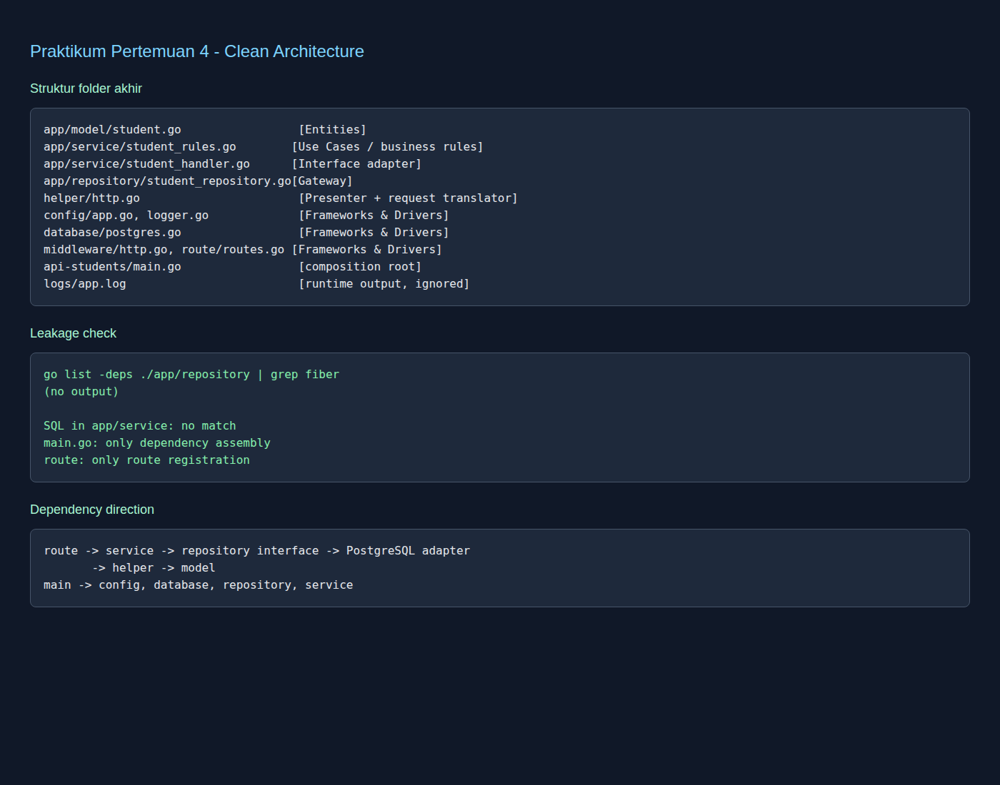
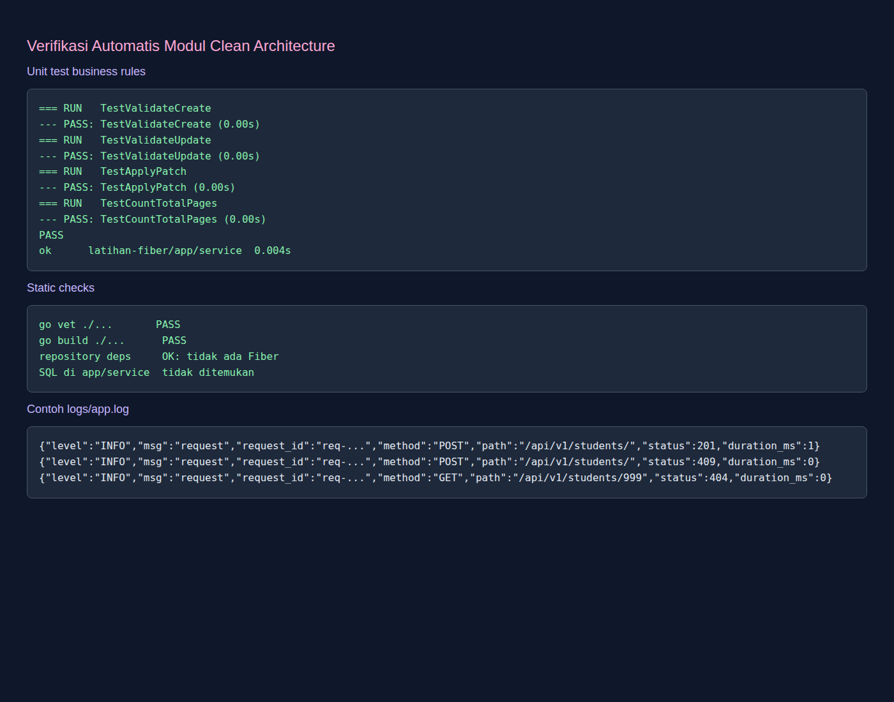
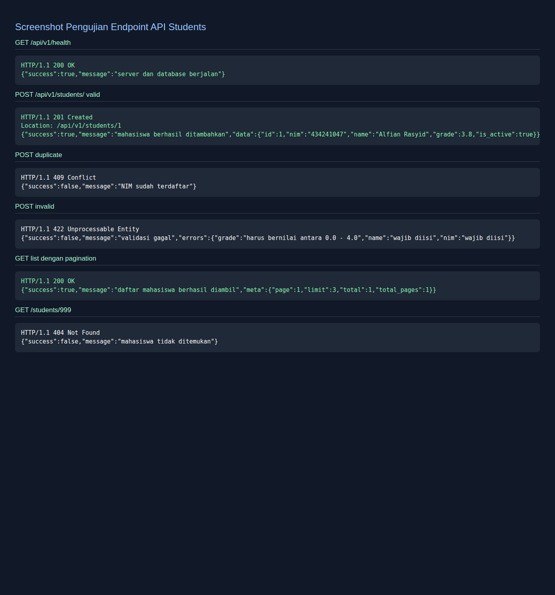

# Laporan Praktikum Pertemuan 4
## Clean Architecture pada API Students

**Nama:** Alfian Rasyid El Fahmi  
**NIM:** 434241047  
**Repositori:** [github.com/ar-elfahmi/latihan-fiber](https://github.com/ar-elfahmi/latihan-fiber)  
**Tanggal pengerjaan:** 4 September 2026

## BAB I PENDAHULUAN

### 1.1 Latar Belakang

Pada tugas sebelumnya, API students sudah dapat menjalankan operasi CRUD, tetapi beberapa tanggung jawab masih berada di package utama. Pada modul ini, kode dipindahkan ke struktur **Clean Architecture**. Clean Architecture adalah cara menyusun program berdasarkan tanggung jawabnya. Aturan utamanya adalah dependency kode mengarah ke bagian yang lebih dalam, bukan sebaliknya.

Perubahan pada praktikum ini tidak menambah fitur baru. Perubahan utamanya adalah letak kode. API tetap memiliki endpoint health dan CRUD students, tetapi sekarang entitas, aturan bisnis, adapter HTTP, repository, konfigurasi, middleware, dan route dipisahkan.

### 1.2 Tujuan

Praktikum ini bertujuan untuk memahami empat layer Clean Architecture, menerapkan dependency rule, memisahkan business rules dari Fiber, membuat unit test yang tidak menyalakan server, memeriksa kebocoran layer, serta membuktikan bahwa endpoint API masih berjalan setelah direstrukturisasi.

## BAB II PERSIAPAN

### 2.1 Kondisi Repositori

Repositori yang digunakan adalah `ar-elfahmi/latihan-fiber`. Berbeda dengan repositori situs yang sempat terbuka pada pemeriksaan awal, repositori ini memang berisi API Go dan database PostgreSQL dari tugas sebelumnya. Oleh karena itu, pengerjaan dilanjutkan langsung pada repositori ini agar perilaku API sebelumnya dapat dipertahankan.

Perintah awal yang digunakan:

```bash
gh repo clone ar-elfahmi/latihan-fiber
cd latihan-fiber
go mod download
```

### 2.2 Struktur Folder Akhir

```text
latihan-fiber/
├── api-students/
│   └── main.go
├── app/
│   ├── model/student.go
│   ├── repository/student_repository.go
│   └── service/
│       ├── student_handler.go
│       ├── student_rules.go
│       └── student_rules_test.go
├── config/
│   ├── app.go
│   ├── env.go
│   └── logger.go
├── database/postgres.go
├── helper/http.go
├── middleware/http.go
├── route/routes.go
├── logs/app.log
└── migrations/001_create_students.sql
```



**Gambar 2.1.** Struktur folder, pemeriksaan kebocoran layer, dan arah dependency.

### 2.3 Menyiapkan PostgreSQL

File `.env` dipakai untuk menyimpan konfigurasi lokal dan tidak dimasukkan ke Git. Nama variabelnya mengikuti `.env.example`.

```env
APP_PORT=3000
DB_USER=praktikum
DB_PASSWORD=praktikum
DB_HOST=localhost
DB_PORT=5432
DB_NAME=praktikum_backend
DB_SSLMODE=disable
```

Migrasi dijalankan dengan perintah berikut.

```bash
psql -U postgres -d praktikum_backend -f migrations/001_create_students.sql
```

Tabel `students` memiliki kolom `id`, `nim`, `name`, `grade`, `is_active`, dan `created_at`. Kolom `nim` memiliki constraint `UNIQUE`. Ada juga indeks `students_name_idx` pada `LOWER(name)` untuk membantu pencarian nama tanpa membedakan huruf besar dan kecil.

## BAB III PROSES PENGERJAAN

### 3.1 Langkah 1: Menyiapkan Folder

Folder yang ditambahkan adalah `app/service`, `helper`, `middleware`, `route`, dan `logs`. Folder `logs` ditambahkan ke `.gitignore` karena isinya adalah keluaran runtime, bukan source code.

```bash
mkdir -p app/service helper middleware route logs
printf '\nlogs/\n.env\n' >> .gitignore
```

### 3.2 Langkah 2: Memisahkan Entities

`app/model/student.go` berisi struct `Student`, struct request, struct response, dan `ListQuery`. Package ini tidak mengimpor package proyek lain. Dengan demikian, entity tidak mengetahui Fiber, database, route, atau konfigurasi.

### 3.3 Langkah 3: Memisahkan Business Rules

Business rules diletakkan di `app/service/student_rules.go`. File ini tidak mengimpor Fiber. Tiga fungsi penting yang dibuat adalah:

1. `ValidateCreate` memeriksa data untuk POST.
2. `ValidateUpdate` memeriksa data untuk PUT.
3. `ApplyPatch` menerapkan perubahan sebagian pada PATCH.

Fungsi tambahan `CountTotalPages` menghitung jumlah halaman dari total data dan limit.

Contoh pemakaian aturan PATCH:

```go
func ApplyPatch(s model.Student, r model.PatchStudentRequest) (model.Student, map[string]string)
```

Fungsi tersebut menerima entity dan data patch, lalu mengembalikan entity yang sudah berubah beserta error validasi. Karena tidak menerima `fiber.Ctx`, fungsi ini dapat diuji dengan cepat.

### 3.4 Langkah 4: Membuat Unit Test

Test ditulis di `app/service/student_rules_test.go`. Test tidak menyalakan server dan tidak membutuhkan database.

```bash
go test ./app/service/... -v
```

Hasilnya adalah empat test lulus, yaitu validasi POST, validasi PUT, penerapan PATCH, dan penghitungan total halaman.



**Gambar 3.1.** Output `go test`, `go vet`, `go build`, dan contoh isi file log.

### 3.5 Langkah 5: Memindahkan Handler dan Presenter

Handler HTTP dipindahkan ke `app/service/student_handler.go`. Handler masih menggunakan `fiber.Ctx` karena tugasnya menjadi adapter antara HTTP dan use case. Handler tidak menulis SQL. Ia hanya membaca request, memanggil repository, lalu menerjemahkan error menjadi status HTTP.

Fungsi response seperti `OK`, `OKList`, `Created`, `Fail`, dan `FailValidation` dipindahkan ke `helper/http.go`. Dengan begitu, format response tidak ditulis berulang kali di setiap handler.

### 3.6 Langkah 6: Memindahkan Pendaftaran Route

`route/routes.go` sekarang hanya mendaftarkan URL dan method ke handler. Route tidak lagi berisi validasi field atau keputusan business rules.

Route yang diuji adalah:

| Method | Endpoint | Keterangan |
|---|---|---|
| GET | `/api/v1/health` | Memeriksa server dan database |
| GET | `/api/v1/students/` | Mengambil daftar students |
| GET | `/api/v1/students/:id` | Mengambil satu student |
| POST | `/api/v1/students/` | Membuat student |
| PUT | `/api/v1/students/:id` | Mengganti seluruh data |
| PATCH | `/api/v1/students/:id` | Mengubah sebagian data |
| DELETE | `/api/v1/students/:id` | Menghapus student |

### 3.7 Langkah 7: Memindahkan Perakitan Aplikasi

`api-students/main.go` sekarang hanya menjadi composition root. File ini memuat environment, membuat connection pool, membuat logger, membuat repository, membuat handler, membuat aplikasi Fiber, lalu menjalankan server.

File `config/app.go` membuat instance Fiber dan memasang request logger. Setiap request dicatat ke layar dan `logs/app.log` dalam format JSON. Field yang dicatat adalah `request_id`, `method`, `path`, `status`, dan `duration_ms`. Jika ukuran file melewati 1 MB, file lama diganti nama menjadi `app.log.1` sebelum logger baru dibuat.

### 3.8 Langkah 8: Verifikasi Kebocoran Layer

Pemeriksaan dilakukan dengan perintah berikut.

```bash
go list -deps ./app/repository | grep fiber
```

Tidak ada output Fiber. Artinya repository tidak mengenal framework web.

Pemeriksaan berikutnya dilakukan terhadap isi `app/service`. Tidak ditemukan perintah SQL. Route hanya berisi pendaftaran endpoint. `main.go` tidak berisi handler dan hanya merakit dependency.

Arah dependency yang digunakan adalah:

```text
route -> service -> repository interface -> adapter PostgreSQL
route -> helper -> model
main -> config, database, repository, service
```



**Gambar 3.2.** Bukti pengujian endpoint health, POST berhasil, konflik NIM, validasi gagal, pagination, dan data tidak ditemukan.

## BAB IV HASIL DAN ANALISIS

### 4.1 Hasil Build dan Unit Test

Perintah berikut berhasil dijalankan.

```bash
go test ./... -v
go vet ./...
go build ./...
```

Semua package berhasil dikompilasi. Empat unit test pada `app/service` juga lulus. Hal ini menunjukkan bahwa pemisahan business rules dapat dilakukan tanpa database dan tanpa server Fiber.

### 4.2 Hasil Pengujian Endpoint

| Skenario | Status | Hasil |
|---|---:|---|
| GET `/api/v1/health` | 200 | Server dan database berjalan |
| POST student valid | 201 | Data dibuat dan header `Location` dikirim |
| POST NIM yang sama | 409 | Constraint unik diterjemahkan menjadi konflik |
| POST data kosong dan grade 5 | 422 | Error tiap field dikembalikan |
| GET list page 1 limit 3 | 200 | Meta pagination tersedia |
| GET `/students/999` | 404 | Data tidak ditemukan |
| GET `/alamat-ngawur` | 404 | Route penampung bekerja |

Pada pengujian POST valid, response memiliki status `201 Created` dan header `Location: /api/v1/students/1`. Pada pengujian NIM yang sama, database menghasilkan error unique violation, kemudian repository menerjemahkannya menjadi `ErrDuplicate`. Handler menerjemahkan error tersebut menjadi `409 Conflict`.

### 4.3 Log Request

Contoh baris log yang dihasilkan:

```json
{"level":"INFO","msg":"request","request_id":"req-...","method":"POST","path":"/api/v1/students/","status":201,"duration_ms":1}
{"level":"INFO","msg":"request","request_id":"req-...","method":"POST","path":"/api/v1/students/","status":409,"duration_ms":0}
{"level":"INFO","msg":"request","request_id":"req-...","method":"GET","path":"/api/v1/students/999","status":404,"duration_ms":0}
```

Setiap request memiliki ID, method, path, status, dan durasi. File log tidak di-commit karena sudah masuk `.gitignore`.

### 4.4 Pemetaan Empat Layer

| Layer | Folder/package | Tanggung jawab |
|---|---|---|
| Entities | `app/model` | Student dan bentuk data request-response |
| Use Cases | `app/service/student_rules.go` | Aturan validasi, patch, dan pagination |
| Interface Adapters | `app/service/student_handler.go`, `helper`, `app/repository` | Menerjemahkan HTTP, response, dan kebutuhan penyimpanan |
| Frameworks & Drivers | `config`, `database`, `middleware`, `route`, `api-students/main.go` | Fiber, PostgreSQL, logger, route, dan perakitan |

### 4.5 Bagian yang Disederhanakan

Clean Architecture murni biasanya menaruh interface repository di package use case, sedangkan implementasinya berada di adapter terpisah. Pada proyek ini interface `StudentRepository` masih berada bersama kontrak repository di `app/repository`, seperti struktur baku yang diberikan modul. Penyederhanaan ini mengurangi jumlah package, tetapi batas antara use case dan adapter menjadi sedikit kurang tegas.

Implementasi database tetap memakai PostgreSQL seperti tugas sebelumnya. Yang berubah adalah handler tidak lagi berada di `api-students`, melainkan dipindahkan ke package service, sementara route dan konfigurasi dipisahkan.

### 4.6 Pendapat Pribadi

Menurut saya, struktur ini cukup sepadan untuk tugas ini karena pemisahan business rules langsung membuat unit test lebih mudah. Untuk API yang hanya terdiri dari beberapa endpoint, jumlah folder memang terasa lebih banyak. Namun ketika fitur bertambah, misalnya autentikasi, otorisasi, database kedua, atau pekerjaan latar belakang, struktur ini mulai membantu karena perubahan tidak perlu menyentuh semua bagian program. Menurut saya, manfaatnya mulai terasa ketika aplikasi memiliki beberapa fitur bisnis dan akan dipelihara lebih dari satu orang.

## BAB V KESIMPULAN

API students berhasil direstrukturisasi mengikuti Clean Architecture tanpa mengubah perilaku endpoint utama. Entity dipisahkan di `app/model`, business rules dipisahkan di `app/service`, adapter HTTP dan presenter dipisahkan dari repository, sedangkan detail Fiber dan PostgreSQL berada di layer luar.

Hasil verifikasi menunjukkan bahwa unit test, `go vet`, dan `go build` berhasil. Pengujian endpoint juga membuktikan status `200`, `201`, `409`, `422`, dan `404` sesuai skenario. Logger menghasilkan satu baris JSON untuk setiap request dan file log tidak masuk commit.

## Referensi

[1]: https://github.com/ar-elfahmi/latihan-fiber "Repositori latihan-fiber"
[2]: https://go.dev/doc/tutorial/create-module "Go Documentation: Create a Go module"
[3]: https://docs.gofiber.io/ "Fiber Go Documentation"

> Catatan bantuan: AI digunakan sebagai alat bantu untuk membaca modul, menyusun langkah refactoring, membantu menulis kerangka kode, dan menyusun laporan. Seluruh source code diverifikasi dengan `go test`, `go vet`, `go build`, pemeriksaan dependency, serta pengujian endpoint langsung terhadap PostgreSQL lokal.
